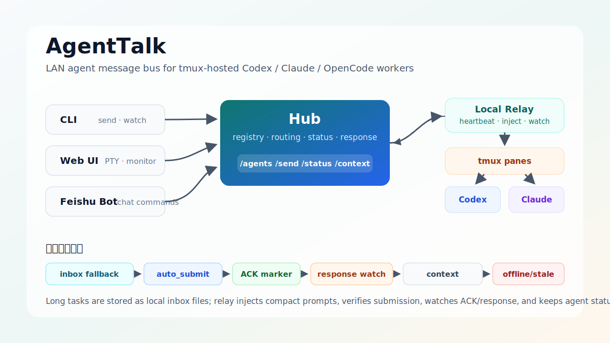

# AgentTalk

## Language / 语言

- [中文说明](#中文说明)
- [English README](#english-readme)

---

## 中文说明

AgentTalk 是一个轻量级局域网 Agent 通信系统，面向运行在 tmux pane 里的 AI agent CLI。Hub 是 server，开发者机器是 client。Hub 提供注册中心、消息路由、Web UI（含原生 PTY 终端）和可选飞书机器人；client relay 负责本机 tmux 注册、消息注入、上下文采集和反馈监控。



> **架构说明**：tmux 用于 agent 进程保活和多窗口管理，PTY 用于 Web UI 中的原生交互式终端。两者互补共存。
> 
> **智能状态监测**：AgentTalk 支持通过 LLM 定期分析 terminal 输出来判断 agent 真实状态（idle/working/thinking/error/stuck），不发送任何消息干扰 agent 工作。

### 快速开始

#### Windows 用户

AgentTalk 支持 Windows 原生运行（无需 WSL）：

**方式 1：Hub 用 Docker，Agent 在 Windows 原生运行（推荐）**

```powershell
# 1. 克隆仓库
git clone https://git.qicore.tech/QiCore/soha_agentTalk.git
cd soha_agentTalk

# 2. 启动 Hub（Docker Desktop 需先安装并运行）
.\scripts\start-hub-windows.ps1

# 3. 安装 CLI
cd ..  # 回到项目根目录
.\scripts\setup-windows.ps1

# 4. 在终端窗口中启动您的 AI Agent，然后注册
agenttalk register --short-id my-agent --tmux-target mywindow:0.0

# 5. 启动 relay
agenttalk daemon start
```

**方式 2：全部原生运行（不装 Docker）**

```powershell
# 1. 克隆仓库
git clone https://git.qicore.tech/QiCore/soha_agentTalk.git
cd soha_agentTalk

# 2. 运行安装脚本
.\scripts\setup-windows.ps1

# 3. 启动 Hub（Python 原生）
agenttalk hub serve --port 8787 --token YOUR_TOKEN

# 4. 在另一个终端中启动 AI Agent 并注册
agenttalk register --short-id my-agent --tmux-target mywindow:0.0
agenttalk daemon start
```

> **Windows 注册说明**：
> - Windows 版不依赖 tmux，`--tmux-target` 只是一个**标识符字符串**（如 `main`、`api-project`、`claude-window`），不需要对应真实的 tmux session
> - 建议用有意义的名称，每个 agent 必须全局唯一
> - Agent 直接在终端窗口中运行，保持窗口打开即可
> - 支持 `auto_submit` 和 `paste_only` 两种接收模式

#### Linux/macOS 用户

#### 1. 部署 Hub Server

```bash
scripts/deploy-hub.sh
```

#### 2. 设置 Agent（推荐：使用便捷脚本）

**检查环境：**
```bash
./scripts/check-env.sh
```

**一键设置 tmux + PTY（不启动 AI agent）：**
```bash
# 进入项目目录
cd /path/to/project

# 交互式设置（创建 tmux session，注册 pane，启动监控）
./scripts/setup-pane.sh

# 或指定参数
./scripts/setup-pane.sh --session my-api --kind codex
```

**在 tmux 中启动您的 AI Agent：**
```bash
# 附加到刚创建的 session
tmux attach -t my-api

# 启动 Claude Code
claude

# 或启动其他 agent CLI
codex
```

#### 3. 启动/管理监控

```bash
# 查看所有 agent 状态
./scripts/start-all-agents.sh --status

# 启动所有已注册 agent 的监控
./scripts/start-all-agents.sh

# 停止监控
./scripts/start-all-agents.sh --stop

# 实时监控日志
./scripts/start-all-agents.sh --monitor
```

#### 传统方式（手动注册）

```bash
scripts/start-client.sh \
  --hub-url http://192.168.1.20:8787 \
  --token <token> \
  --short-id alice-codex-api \
  --tmux-target dev:0.1 \
  --owner alice \
  --kind codex \
  --workspace /workspace/service-api
```

### 常用入口

- [Server quickstart](docs/guides/server-quickstart.md)
- [Client quickstart](docs/guides/client-quickstart.md)
- [Docker deployment](docs/guides/docker-deployment.md)
- [Feishu bot setup](docs/guides/feishu-bot-setup.md)
- [CLI reference](docs/reference/cli.md)
- [Project overview](docs/overview.md)
- [Agent skill usage](docs/guides/agent-skill-usage.md)

### Agent Skill

仓库内置 agent 入口和 skill：

- [Agent instructions](AGENTS.md)
- [AgentTalk skill](.agents/skills/agenttalk/SKILL.md)

#### 如何为 Agent 配置 Skill

**Claude Code 用户：**
```bash
# 复制 skill 到 Claude Code 配置目录
cp .agents/skills/agenttalk/SKILL.md ~/.claude/skills/
```

**其他 Agent：**
将 `.agents/skills/agenttalk/SKILL.md` 放入 agent 可读取的 skills 目录。

#### Skill 能力

启用后，agent 可以：

1. **发现 Peers** - 查看 LAN 中其他在线 agent
2. **检查上下文** - 查看目标 agent 的终端输出（避免打扰忙碌的 agent）
3. **发送请求** - 向其他 agent 发送协作任务
4. **接收消息** - 处理来自其他 agent 的请求并返回结果

#### Agent 间协作示例

```bash
# 发现其他 agent
agenttalk list

# 查看目标 agent 状态（检查是否忙碌）
agenttalk context alice-codex-api --lines 120

# 发送协作请求
agenttalk send --to alice-codex-api \
  --message "请检查 docs/api.md 的接口契约，重点关注错误处理"

# 等待响应（--watch 模式）
agenttalk send --to alice-codex-api \
  --message "请检查 docs/api.md" --watch
```

### 可靠投递与故障恢复

AgentTalk 的 P0 可靠性链路包括：

- 消息状态链：`sent -> delivered -> submitted -> acked -> completed`
- `submitted` 表示本地 relay 已确认 Enter 生效，不只是把文本粘贴进输入框
- `acked` 表示目标 agent 已打印 `AGENTTALK_ACK:<message-id>`，确认任务已被 agent 看到
- ACK 不是最终回复；目标 agent 打印 ACK 后必须继续执行任务，直到打印 done marker
- `submit_unconfirmed` 表示 relay 怀疑消息仍停在输入框，需检查 DLQ
- 长消息默认写入本地 inbox 文件，tmux 只注入短指令，降低 Codex/Claude TUI 粘贴失败风险
- CLI 和本地 relay 会对 Hub/TLS 连接建立阶段的短暂 EOF/断连做有限重试；安全的 Hub 写回接口也会重试临时 `502/503/504`
- relay 每轮会重新读取本地配置，新增或改名后的 agent 不需要等到下次 daemon restart 才能注册和 heartbeat
- relay 会把待 watch 的消息持久化到 `~/.agenttalk/watch_states.json`；如果 daemon 重启或 Hub 临时不可用，后续轮询仍可继续尝试完成回传
- relay watch 到 `Selected model is at capacity` 时会自动向目标 pane 发送 `继续`，同一段输出只发送一次
- 如果 Hub 请求仍失败，CLI 会给出可读错误和后续 `status/response/context` 追踪命令

本地 relay 管理：

```bash
agenttalk doctor
agenttalk daemon install
agenttalk daemon status
agenttalk daemon restart
agenttalk daemon stop
```

死信队列：

```bash
agenttalk dlq list
agenttalk dlq retry <message-id>
agenttalk dlq fail <message-id> --reason "manual close"
```

飞书机器人可查看投递证据链，但不能直接控制开发机本地 daemon：

```text
/status <message-id>
/response <message-id>
/trace <message-id>
/guide reliability
```

#### 消息格式建议

Agent 间通信应使用清晰的任务描述：

```text
请检查 <文件路径或主题>。
重点关注 <具体风险点>。
先返回发现，然后简短总结。
```

### 安全注意事项

`scripts/start-client.sh --discover` 和 `agenttalk discover` 只读 tmux pane 元数据。消息投递会写入已注册 pane。只注册明确允许 AgentTalk 输入的 pane。

测试 tmux 时只使用：

```text
agenttalk-e2e-*
```

### 验证

最近验证结果：

```text
uv run pytest        123 passed
npm run lint         passed
npm run build        passed
npm run test:e2e     4 passed
docker build         passed
docker smoke         passed
```

---

## English README

AgentTalk is a lightweight LAN communication system for tmux-hosted AI agent CLIs. The Hub is the server, and each developer machine is a client. The Hub provides registry, message routing, Web UI (with native PTY terminal), and an optional Feishu bot; the client relay handles local tmux registration, message injection, context capture, and response monitoring.

> **Architecture Note**: tmux is used for agent process keepalive and multi-window management, while PTY provides native interactive terminals in the Web UI. They complement each other.

### Quick Start

Deploy the Hub server:

```bash
scripts/deploy-hub.sh
```

Start a local client relay:

```bash
scripts/start-client.sh \
  --hub-url http://192.168.1.20:8787 \
  --token <token> \
  --short-id alice-codex-api \
  --tmux-target dev:0.1 \
  --owner alice \
  --kind codex \
  --workspace /workspace/service-api
```

Discover local tmux panes read-only:

```bash
scripts/start-client.sh --discover
```

### Reliable Delivery

AgentTalk now tracks delivery through `sent -> delivered -> submitted -> acked -> completed`.
`submitted` means the local relay confirmed that Enter took effect; `acked` means the target agent printed `AGENTTALK_ACK:<message-id>`. ACK is not a final answer: the target agent must continue the task after ACK and only finish when it prints the done marker.
If submit cannot be confirmed, the message is marked `submit_unconfirmed` and recorded in the local dead-letter queue.
When the relay watch loop sees `Selected model is at capacity`, it automatically sends `继续` to the target pane once for that output.

Local relay operations:

```bash
agenttalk doctor
agenttalk daemon install
agenttalk daemon status
agenttalk daemon restart
agenttalk dlq list
agenttalk dlq retry <message-id>
```

Feishu bot equivalents for remote inspection:

```text
/status <message-id>
/response <message-id>
/trace <message-id>
/guide reliability
```

### Main Docs

- [Server quickstart](docs/guides/server-quickstart.md)
- [Client quickstart](docs/guides/client-quickstart.md)
- [Docker deployment](docs/guides/docker-deployment.md)
- [Feishu bot setup](docs/guides/feishu-bot-setup.md)
- [CLI reference](docs/reference/cli.md)
- [Project overview](docs/overview.md)
- [Agent skill usage](docs/guides/agent-skill-usage.md)

### Agent Skill

Repository-bundled agent entry point and skill:

- [Agent instructions](AGENTS.md)
- [AgentTalk skill](.agents/skills/agenttalk/SKILL.md)

### Safety

`scripts/start-client.sh --discover` and `agenttalk discover` only read tmux pane metadata. Message delivery writes to registered panes. Only register panes that are intended to receive AgentTalk input.

For tmux tests, only use:

```text
agenttalk-e2e-*
```

### Verification

Latest verified results:

```text
uv run pytest        123 passed
npm run lint         passed
npm run build        passed
npm run test:e2e     4 passed
docker build         passed
docker smoke         passed
```
